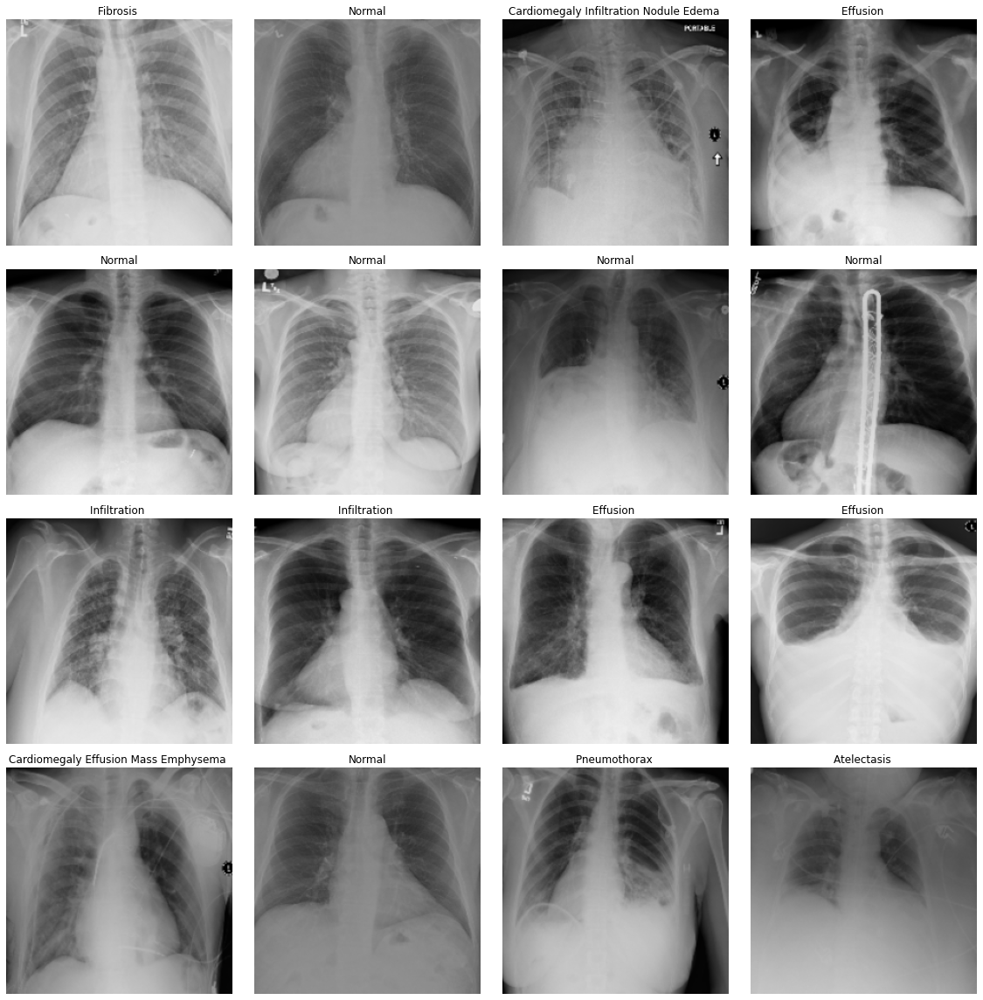
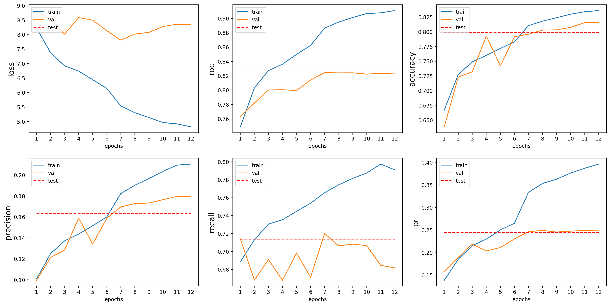

[<- go back to the previous page](../chestxray/README.md)

# Walk Through Part 2.
1. Set up
2. Train Test split
3. DataSet & DataLoader
4. Visualize the dataset
5. Build a model
6. Fit/Train the model

# 1. Set up

## 1.1 Import libraries


```python
import numpy as np
import pandas as pd
import matplotlib.pyplot as plt
import seaborn as sns

import os, glob

import tensorflow as tf
print('Tensorflow version: ', tf.__version__)

from sklearn.model_selection import train_test_split
```

    Tensorflow version:  2.4.1


## 1.2 Set up accelerator - **TPU**


```python
# Accelerator

def setup_accelerator():
    try:
        tpu = tf.distribute.cluster_resolver.TPUClusterResolver()
        tf.config.experimental_connect_to_cluster(tpu)
        tf.tpu.experimental.initialize_tpu_system(tpu)
        strategy = tf.distribute.experimental.TPUStrategy(tpu)
        print('Running on TPU: ', tpu.master())
    except ValueError:
        strategy = tf.distribute.get_strategy() # for CPU or GPU
    print('Number of replicas:', strategy.num_replicas_in_sync)
    return strategy

strategy = setup_accelerator()
```

    Running on TPU:  grpc://10.0.0.2:8470
    Number of replicas: 8


## 1.3 Set up directories


```python
input_dir1 = '../input/data/'
input_dir2 = '../input/chestxray-part1/'
output_dir = ''
```

## 1.4 Load the data


```python
df = pd.read_csv(input_dir2 + 'chestxray_df.csv', index_col = 'Unnamed: 0')
```


```python
print(df.info())
df.head()
```

    <class 'pandas.core.frame.DataFrame'>
    Int64Index: 111863 entries, 0 to 112119
    Data columns (total 17 columns):
     #   Column              Non-Null Count   Dtype 
    ---  ------              --------------   ----- 
     0   Path                111863 non-null  object
     1   Patient ID          111863 non-null  int64 
     2   Atelectasis         111863 non-null  int64 
     3   Cardiomegaly        111863 non-null  int64 
     4   Effusion            111863 non-null  int64 
     5   Infiltration        111863 non-null  int64 
     6   Mass                111863 non-null  int64 
     7   Nodule              111863 non-null  int64 
     8   Pneumonia           111863 non-null  int64 
     9   Pneumothorax        111863 non-null  int64 
     10  Consolidation       111863 non-null  int64 
     11  Edema               111863 non-null  int64 
     12  Emphysema           111863 non-null  int64 
     13  Fibrosis            111863 non-null  int64 
     14  Pleural_Thickening  111863 non-null  int64 
     15  Hernia              111863 non-null  int64 
     16  No Finding          111863 non-null  int64 
    dtypes: int64(16), object(1)
    memory usage: 15.4+ MB
    None


<div>
<style scoped>
    .dataframe tbody tr th:only-of-type {
        vertical-align: middle;
    }

    .dataframe tbody tr th {
        vertical-align: top;
    }

    .dataframe thead th {
        text-align: right;
    }
</style>
<table border="1" class="dataframe">
  <thead>
    <tr style="text-align: right;">
      <th></th>
      <th>Path</th>
      <th>Patient ID</th>
      <th>Atelectasis</th>
      <th>Cardiomegaly</th>
      <th>Effusion</th>
      <th>Infiltration</th>
      <th>Mass</th>
      <th>Nodule</th>
      <th>Pneumonia</th>
      <th>Pneumothorax</th>
      <th>Consolidation</th>
      <th>Edema</th>
      <th>Emphysema</th>
      <th>Fibrosis</th>
      <th>Pleural_Thickening</th>
      <th>Hernia</th>
      <th>No Finding</th>
    </tr>
  </thead>
  <tbody>
    <tr>
      <th>0</th>
      <td>images_001/images/00000001_000.png</td>
      <td>1</td>
      <td>0</td>
      <td>1</td>
      <td>0</td>
      <td>0</td>
      <td>0</td>
      <td>0</td>
      <td>0</td>
      <td>0</td>
      <td>0</td>
      <td>0</td>
      <td>0</td>
      <td>0</td>
      <td>0</td>
      <td>0</td>
      <td>0</td>
    </tr>
    <tr>
      <th>1</th>
      <td>images_001/images/00000001_001.png</td>
      <td>1</td>
      <td>0</td>
      <td>1</td>
      <td>0</td>
      <td>0</td>
      <td>0</td>
      <td>0</td>
      <td>0</td>
      <td>0</td>
      <td>0</td>
      <td>0</td>
      <td>1</td>
      <td>0</td>
      <td>0</td>
      <td>0</td>
      <td>0</td>
    </tr>
    <tr>
      <th>2</th>
      <td>images_001/images/00000001_002.png</td>
      <td>1</td>
      <td>0</td>
      <td>1</td>
      <td>1</td>
      <td>0</td>
      <td>0</td>
      <td>0</td>
      <td>0</td>
      <td>0</td>
      <td>0</td>
      <td>0</td>
      <td>0</td>
      <td>0</td>
      <td>0</td>
      <td>0</td>
      <td>0</td>
    </tr>
    <tr>
      <th>3</th>
      <td>images_001/images/00000002_000.png</td>
      <td>2</td>
      <td>0</td>
      <td>0</td>
      <td>0</td>
      <td>0</td>
      <td>0</td>
      <td>0</td>
      <td>0</td>
      <td>0</td>
      <td>0</td>
      <td>0</td>
      <td>0</td>
      <td>0</td>
      <td>0</td>
      <td>0</td>
      <td>1</td>
    </tr>
    <tr>
      <th>4</th>
      <td>images_001/images/00000003_000.png</td>
      <td>3</td>
      <td>0</td>
      <td>0</td>
      <td>0</td>
      <td>0</td>
      <td>0</td>
      <td>0</td>
      <td>0</td>
      <td>0</td>
      <td>0</td>
      <td>0</td>
      <td>0</td>
      <td>0</td>
      <td>0</td>
      <td>1</td>
      <td>0</td>
    </tr>
  </tbody>
</table>
</div>


## 1.5 Update the root path of Path with data's **TPU** address


```python
!ls -l '/kaggle/input'
```

    total 0
    drwxr-xr-x  2 nobody nogroup 0 Apr 12 07:36 chestxray-best
    drwxr-xr-x  3 nobody nogroup 0 Apr 12 05:42 chestxray-part1
    drwxr-xr-x 14 nobody nogroup 0 Dec  8 01:22 data


```python
from kaggle_datasets import KaggleDatasets
GCS_PATH = KaggleDatasets().get_gcs_path('data')
print("GCS_PATH: ", GCS_PATH)

df['Path'] = GCS_PATH + '/' + df['Path']
df.head()
```

    GCS_PATH:  gs://kds-c31ca1e9d658869c5f50c7bd25e5f7da4b43b32a082b49173ef8b26e


<div>
<style scoped>
    .dataframe tbody tr th:only-of-type {
        vertical-align: middle;
    }

    .dataframe tbody tr th {
        vertical-align: top;
    }

    .dataframe thead th {
        text-align: right;
    }
</style>
<table border="1" class="dataframe">
  <thead>
    <tr style="text-align: right;">
      <th></th>
      <th>Path</th>
      <th>Patient ID</th>
      <th>Atelectasis</th>
      <th>Cardiomegaly</th>
      <th>Effusion</th>
      <th>Infiltration</th>
      <th>Mass</th>
      <th>Nodule</th>
      <th>Pneumonia</th>
      <th>Pneumothorax</th>
      <th>Consolidation</th>
      <th>Edema</th>
      <th>Emphysema</th>
      <th>Fibrosis</th>
      <th>Pleural_Thickening</th>
      <th>Hernia</th>
      <th>No Finding</th>
    </tr>
  </thead>
  <tbody>
    <tr>
      <th>0</th>
      <td>gs://kds-c31ca1e9d658869c5f50c7bd25e5f7da4b43b...</td>
      <td>1</td>
      <td>0</td>
      <td>1</td>
      <td>0</td>
      <td>0</td>
      <td>0</td>
      <td>0</td>
      <td>0</td>
      <td>0</td>
      <td>0</td>
      <td>0</td>
      <td>0</td>
      <td>0</td>
      <td>0</td>
      <td>0</td>
      <td>0</td>
    </tr>
    <tr>
      <th>1</th>
      <td>gs://kds-c31ca1e9d658869c5f50c7bd25e5f7da4b43b...</td>
      <td>1</td>
      <td>0</td>
      <td>1</td>
      <td>0</td>
      <td>0</td>
      <td>0</td>
      <td>0</td>
      <td>0</td>
      <td>0</td>
      <td>0</td>
      <td>0</td>
      <td>1</td>
      <td>0</td>
      <td>0</td>
      <td>0</td>
      <td>0</td>
    </tr>
    <tr>
      <th>2</th>
      <td>gs://kds-c31ca1e9d658869c5f50c7bd25e5f7da4b43b...</td>
      <td>1</td>
      <td>0</td>
      <td>1</td>
      <td>1</td>
      <td>0</td>
      <td>0</td>
      <td>0</td>
      <td>0</td>
      <td>0</td>
      <td>0</td>
      <td>0</td>
      <td>0</td>
      <td>0</td>
      <td>0</td>
      <td>0</td>
      <td>0</td>
    </tr>
    <tr>
      <th>3</th>
      <td>gs://kds-c31ca1e9d658869c5f50c7bd25e5f7da4b43b...</td>
      <td>2</td>
      <td>0</td>
      <td>0</td>
      <td>0</td>
      <td>0</td>
      <td>0</td>
      <td>0</td>
      <td>0</td>
      <td>0</td>
      <td>0</td>
      <td>0</td>
      <td>0</td>
      <td>0</td>
      <td>0</td>
      <td>0</td>
      <td>1</td>
    </tr>
    <tr>
      <th>4</th>
      <td>gs://kds-c31ca1e9d658869c5f50c7bd25e5f7da4b43b...</td>
      <td>3</td>
      <td>0</td>
      <td>0</td>
      <td>0</td>
      <td>0</td>
      <td>0</td>
      <td>0</td>
      <td>0</td>
      <td>0</td>
      <td>0</td>
      <td>0</td>
      <td>0</td>
      <td>0</td>
      <td>0</td>
      <td>1</td>
      <td>0</td>
    </tr>
  </tbody>
</table>
</div>


## 1.6 Set up variables
- BATCH_SIZE is multiplied by the number of replicas of **TPU**
- AUTO is a variable for **TPU**


```python
class_names = df.drop(['Path', 'Patient ID'], axis=1).columns.to_list()
n_classes = len(class_names)

SEED = 42
IMG_SIZE = (224, 224)
BATCH_SIZE = 16 * strategy.num_replicas_in_sync

AUTO = tf.data.experimental.AUTOTUNE
```


```python
# Final class_names, n_classes
class_names.remove('No Finding')
n_classes = len(class_names)
print("n_classes: ", n_classes)
print(class_names)
```

    n_classes:  14
    ['Atelectasis', 'Cardiomegaly', 'Effusion', 'Infiltration', 'Mass', 'Nodule', 'Pneumonia', 'Pneumothorax', 'Consolidation', 'Edema', 'Emphysema', 'Fibrosis', 'Pleural_Thickening', 'Hernia']


# 2. Train Test Split

## 2.1 Data leakage prevention: Split train and test set by **Patient ID**, not by Image ID

### 2.1.1 Split Patient ID
Train : valid : test = 80%: 10%: 10%


```python
from sklearn.model_selection import train_test_split

uid = df['Patient ID'].unique()
train_id = uid
#train_id, discard = train_test_split(uid, test_size=0.95, random_state=SEED) # Discard option
train_id, test_id = train_test_split(train_id, test_size=0.2, random_state=SEED)
valid_id, test_id = train_test_split(test_id, test_size=0.5, random_state=SEED)
print('The size of Patient ID')
print(f'tain_id: {len(train_id)}, valid_id: {len(valid_id)}, test_id: {len(test_id)}')
```

    The size of Patient ID
    tain_id: 24618, valid_id: 3077, test_id: 3078


### 2.1.2 Apply splitted Patient ID on train, valid, and test df 


```python
train_df = df[df['Patient ID'].isin(train_id)]
valid_df = df[df['Patient ID'].isin(valid_id)]
test_df = df[df['Patient ID'].isin(test_id)]

n_train = len(train_df)
n_valid = len(valid_df)
n_test = len(test_df)

print('The size of Image ID')
print(f'tain_df: {n_train}, valid_df: {n_valid}, test_df: {n_test}')
```

    The size of Image ID
    tain_df: 88641, valid_df: 11693, test_df: 11529


### 2.1.3 Check data leakage


```python
def check_for_leakage(df1, df2, id_col):
    
    df1_unique_id = set(df1[id_col].unique())
    df2_unique_id = set(df2[id_col].unique())
    
    overlap_id = list(df1_unique_id & df2_unique_id)
    leakage = len(overlap_id) > 0
    
    return leakage 

leakage_btw_train_valid = check_for_leakage(train_df, valid_df, 'Patient ID')
leakage_btw_train_test = check_for_leakage(train_df, test_df, 'Patient ID')
leakage_btw_valid_test = check_for_leakage(valid_df, test_df, 'Patient ID')
print("Leakage between train and valid: ", leakage_btw_train_valid)
print("Leakage between train and test: ", leakage_btw_train_test)
print("Leakage between valid and test: ", leakage_btw_valid_test)
```

    Leakage between train and valid:  False
    Leakage between train and test:  False
    Leakage between valid and test:  False


### 2.1.4 Assign (X, y_true) = (Xpath, label) for train, valid, and test set


```python
Xpath_train, label_train = train_df['Path'], train_df[class_names]
Xpath_valid, label_valid = valid_df['Path'], valid_df[class_names]
Xpath_test, label_test = test_df['Path'], test_df[class_names]
```


```python
Xpath_train.head()
```


    0    gs://kds-c31ca1e9d658869c5f50c7bd25e5f7da4b43b...
    1    gs://kds-c31ca1e9d658869c5f50c7bd25e5f7da4b43b...
    2    gs://kds-c31ca1e9d658869c5f50c7bd25e5f7da4b43b...
    3    gs://kds-c31ca1e9d658869c5f50c7bd25e5f7da4b43b...
    4    gs://kds-c31ca1e9d658869c5f50c7bd25e5f7da4b43b...
    Name: Path, dtype: object


```python
label_train.head()
```


<div>
<style scoped>
    .dataframe tbody tr th:only-of-type {
        vertical-align: middle;
    }

    .dataframe tbody tr th {
        vertical-align: top;
    }

    .dataframe thead th {
        text-align: right;
    }
</style>
<table border="1" class="dataframe">
  <thead>
    <tr style="text-align: right;">
      <th></th>
      <th>Atelectasis</th>
      <th>Cardiomegaly</th>
      <th>Effusion</th>
      <th>Infiltration</th>
      <th>Mass</th>
      <th>Nodule</th>
      <th>Pneumonia</th>
      <th>Pneumothorax</th>
      <th>Consolidation</th>
      <th>Edema</th>
      <th>Emphysema</th>
      <th>Fibrosis</th>
      <th>Pleural_Thickening</th>
      <th>Hernia</th>
    </tr>
  </thead>
  <tbody>
    <tr>
      <th>0</th>
      <td>0</td>
      <td>1</td>
      <td>0</td>
      <td>0</td>
      <td>0</td>
      <td>0</td>
      <td>0</td>
      <td>0</td>
      <td>0</td>
      <td>0</td>
      <td>0</td>
      <td>0</td>
      <td>0</td>
      <td>0</td>
    </tr>
    <tr>
      <th>1</th>
      <td>0</td>
      <td>1</td>
      <td>0</td>
      <td>0</td>
      <td>0</td>
      <td>0</td>
      <td>0</td>
      <td>0</td>
      <td>0</td>
      <td>0</td>
      <td>1</td>
      <td>0</td>
      <td>0</td>
      <td>0</td>
    </tr>
    <tr>
      <th>2</th>
      <td>0</td>
      <td>1</td>
      <td>1</td>
      <td>0</td>
      <td>0</td>
      <td>0</td>
      <td>0</td>
      <td>0</td>
      <td>0</td>
      <td>0</td>
      <td>0</td>
      <td>0</td>
      <td>0</td>
      <td>0</td>
    </tr>
    <tr>
      <th>3</th>
      <td>0</td>
      <td>0</td>
      <td>0</td>
      <td>0</td>
      <td>0</td>
      <td>0</td>
      <td>0</td>
      <td>0</td>
      <td>0</td>
      <td>0</td>
      <td>0</td>
      <td>0</td>
      <td>0</td>
      <td>0</td>
    </tr>
    <tr>
      <th>4</th>
      <td>0</td>
      <td>0</td>
      <td>0</td>
      <td>0</td>
      <td>0</td>
      <td>0</td>
      <td>0</td>
      <td>0</td>
      <td>0</td>
      <td>0</td>
      <td>0</td>
      <td>0</td>
      <td>0</td>
      <td>1</td>
    </tr>
  </tbody>
</table>
</div>


# 3. DataSet & DataLoader - **TPU** 

## 3.1 DataSet
1. Convert to Tensor
2. Decode images
3. Cache
4. Image augmentation
5. Image normalization

## 3.2 DataLoader
1. Shuffle
2. Repeat
3. Batch
4. Prefetch


```python
def decode_image(labeled=True, target_size=IMG_SIZE):
    
    def decode_unlabeled_image(Xpath):

        image = tf.io.read_file(Xpath)
        image = tf.image.decode_png(image, channels=3)
        image = tf.image.convert_image_dtype(image, tf.float32) # [0, 1]
        image = tf.image.resize(image, target_size)
        return image
    
    def decode_labeled_image(Xpath, label):
        label = tf.cast(label, tf.float32)
        return decode_unlabeled_image(Xpath), label
    
    return decode_labeled_image if labeled else decode_unlabeled_image

def _get_imagenet_mean_std():
    mean = np.array([0.485, 0.456, 0.406], dtype=np.float32).reshape((1,1,3))
    std = np.array([0.229, 0.224, 0.225], dtype=np.float32).reshape((1,1,3))
    return mean, std

def normalize(labeled=True, mean=None, std=None):
    
    if mean is None:
        mean = tf.math.reduce_mean(image)
    if std is None:
        std = tf.math.reduce_std(image)
    
    def unlabeled_normalize(image):

        image = image - mean
        image = image / std
        return image
    
    def labeled_normalize(image, label):
        return unlabeled_normalize(image), label
    
    return labeled_normalize if labeled else unlabeled_normalize

def denormalize(image): 
    mean, std = _get_imagenet_mean_std()
    image = image * std + mean
    image = tf.clip_by_value(image, 0, 1)    
    return image

def train_transform(image, label):

    image = tf.image.resize(image, (256, 256))
    image = tf.image.central_crop(image, 0.875)
    
    image = tf.image.random_flip_left_right(image, seed=SEED)
    return image, label

def test_transform(image, label=None):
    
    image = tf.image.resize(image, (256, 256))
    image = tf.image.central_crop(image, 0.875)
    if label is None: return image
    return image, label
```


```python
def DataSet(Xpath, label=None, norm=True, transform=None):

    labeled = label is not None

    slices = (Xpath, label) if labeled else Xpath
    dataset = tf.data.Dataset.from_tensor_slices(slices)

    decoder_fn = decode_image(labeled)
    dataset = dataset.map(decoder_fn, num_parallel_calls=AUTO)

    dataset = dataset.cache()

    if transform is not None: 
        dataset = dataset.map(transform, num_parallel_calls=AUTO)
    
    if norm: 
        mean, std = _get_imagenet_mean_std()
        norm_fn = normalize(labeled, mean, std)
        dataset = dataset.map(norm_fn, num_parallel_calls=AUTO)
    
    return dataset

def DataLoader(dataset, batch_size=BATCH_SIZE, shuffle=True, repeat=True):
    
    if shuffle:
        dataset = dataset.shuffle(2048)
    
    if repeat:
        dataset = dataset.repeat()
    
    dataset = dataset.batch(batch_size)
    dataset = dataset.prefetch(AUTO)

    return dataset
```


```python
trainset = DataSet(Xpath_train, label_train, norm=True, transform=train_transform)
validset = DataSet(Xpath_valid, label_valid, norm=True, transform=test_transform)
testset = DataSet(Xpath_test, label_test, norm=True, transform=test_transform)

trainloader = DataLoader(trainset)
validloader = DataLoader(validset, shuffle=False, repeat=False)
testloader = DataLoader(testset, shuffle=False, repeat=False)
```

# 4. Visualize the dataset
- Load images from **TPU**


```python
def label_to_str(label, sep=" "):
    strlabel = ""
    for i, y in enumerate(label):
        if y == 1:
            strlabel += class_names[i] + sep
    if strlabel == "":
        strlabel = 'Normal'
    return strlabel

def trainset_visualize(dataloader, labeled=True, normalized=True):  

    data = list(dataloader.take(1).as_numpy_iterator())[0]
    images = data[0]
    if labeled:
        labels = data[1]

    fig, axes = plt.subplots(4, 4, figsize=(16, 16))
    axes = axes.flatten()
    for i in range(16):
        if normalized:
            images[i] = denormalize(images[i])
        axes[i].imshow(images[i], cmap='gray')
        axes[i].axis('off')
        if labeled:
            axes[i].set_title(label_to_str(labels[i]))
    plt.tight_layout()
    plt.show()
```


```python
trainset_visualize(trainloader)
```


    

    


# 5. Build a model

## 5.1 Weighted loss

### 5.1.1 Compute positive and negative weights from training


```python
def compute_train_weights():
    
    n_train = label_train.shape[0]
    pos_counts = label_train.sum(axis=0)
    neg_counts = n_train - pos_counts
    pos_weights = n_train/(2*pos_counts)
    neg_weights = n_train/(2*neg_counts)
    
    return pos_weights, neg_weights

pos_weights, neg_weights = compute_train_weights()

print('class name: positive weight, negative weight')
for i in range(n_classes):
    print(f'{class_names[i]}: {pos_weights[i]:.2f}, {neg_weights[i]:.2f}')
```

    class name: positive weight, negative weight
    Atelectasis: 4.85, 0.56
    Cardiomegaly: 19.93, 0.51
    Effusion: 4.25, 0.57
    Infiltration: 2.80, 0.61
    Mass: 9.84, 0.53
    Nodule: 8.65, 0.53
    Pneumonia: 39.43, 0.51
    Pneumothorax: 10.74, 0.52
    Consolidation: 11.87, 0.52
    Edema: 24.75, 0.51
    Emphysema: 23.88, 0.51
    Fibrosis: 34.22, 0.51
    Pleural_Thickening: 16.71, 0.52
    Hernia: 275.28, 0.50


### 5.1.2 Create weighted binary cross-entropy for multi-label classification


```python
def create_weighted_BCE(pos_weights, neg_weights, epsilon=1e-7):
    def weighted_BCE(y_true, y_pred):
        
        tf_y_true = tf.cast(y_true, dtype=y_pred.dtype)
        tf_y_pred = tf.cast(y_pred, dtype=y_pred.dtype)
        
        loss = 0.0
        for i in range(len(pos_weights)):
            loss_pos = -1 * tf.math.reduce_mean(pos_weights[i] * tf_y_true[:, i] * tf.math.log(tf_y_pred[:, i] + epsilon))
            loss_neg = -1 * tf.math.reduce_mean(neg_weights[i] * (1 - tf_y_true[:, i]) * tf.math.log(1 - tf_y_pred[:, i] + epsilon))
            loss += loss_pos + loss_neg
        return loss
    return weighted_BCE
```

## 5.2 Build a model


```python
LR = 1e-4
EPOCHS = 100
```


```python
def build_model():
    
    base_model = tf.keras.applications.DenseNet121(input_shape=(*IMG_SIZE, 3),
                                                   include_top=False, 
                                                   weights='imagenet')
    #base_model.trainable = False
    
    model = tf.keras.Sequential([
        base_model,
        tf.keras.layers.GlobalAveragePooling2D(),
        tf.keras.layers.Dense(n_classes, activation = 'sigmoid')
    ])
    
    return model
```

## 5.3 Compile
- strategy.scopre() for **TPU**
- Accuracy calculation for Multi-label: Use BinaryAccuracy() instead of regular Accuracy() 
- Class imbalance solution: Use metrics, Precision, Recall, PR AUC, ROC AUC


```python
with strategy.scope():
    model = build_model()
    
    optimizer = tf.keras.optimizers.Adam(learning_rate=LR)
    loss = create_weighted_BCE(pos_weights, neg_weights)
    metrics=[tf.keras.metrics.BinaryAccuracy(name="accuracy"),
             tf.keras.metrics.Precision(name='precision'),
             tf.keras.metrics.Recall(name='recall'),
             tf.keras.metrics.AUC(curve='pr', name='pr', multi_label=True),
             tf.keras.metrics.AUC(curve='ROC', name='roc', multi_label=True)]
    
    model.compile(optimizer=optimizer, 
                  loss=loss, 
                  metrics=metrics)
```


```python
model.summary()
```

    Model: "sequential"
    _________________________________________________________________
    Layer (type)                 Output Shape              Param #   
    =================================================================
    densenet121 (Functional)     (None, 7, 7, 1024)        7037504   
    _________________________________________________________________
    global_average_pooling2d (Gl (None, 1024)              0         
    _________________________________________________________________
    dense (Dense)                (None, 14)                14350     
    =================================================================
    Total params: 7,051,854
    Trainable params: 6,968,206
    Non-trainable params: 83,648
    _________________________________________________________________


# 6. Train/Fit the model


```python
FILEPATH = output_dir + "nih_densenet121_model.h5"
ckp = tf.keras.callbacks.ModelCheckpoint(FILEPATH, monitor = 'val_loss',
                      verbose = 1, save_best_only = True, mode = 'min')
rlr = tf.keras.callbacks.ReduceLROnPlateau(monitor = 'val_loss', factor = 0.1, patience = 3, verbose = 1, 
                                           min_delta = 1e-4, min_lr = 1e-8, mode = 'min', cooldown=1)
es = tf.keras.callbacks.EarlyStopping(monitor = 'val_loss', min_delta = 1e-4, patience = 5, mode = 'min', 
                    restore_best_weights = True, verbose = 1)
```


```python
history = model.fit(
    trainloader,
    steps_per_epoch = n_train // BATCH_SIZE,
    epochs = EPOCHS,
    validation_data = validloader,
    validation_steps = n_valid // BATCH_SIZE,
    callbacks = [ckp, rlr, es],
    verbose=1
)
```

    Epoch 1/100
    692/692 [==============================] - 3211s 4s/step - loss: 8.9373 - accuracy: 0.6320 - precision: 0.0793 - recall: 0.6122 - pr: 0.1038 - roc: 0.6911 - val_loss: 9.1305 - val_accuracy: 0.6761 - val_precision: 0.1093 - val_recall: 0.7057 - val_pr: 0.1597 - val_roc: 0.7561
    
    Epoch 00001: val_loss improved from inf to 9.13047, saving model to nih_densenet121_model.h5
    Epoch 2/100
    692/692 [==============================] - 90s 129ms/step - loss: 7.6005 - accuracy: 0.7246 - precision: 0.1114 - recall: 0.6789 - pr: 0.1678 - roc: 0.7863 - val_loss: 8.4648 - val_accuracy: 0.6850 - val_precision: 0.1108 - val_recall: 0.6948 - val_pr: 0.1896 - val_roc: 0.7859
    
    Epoch 00002: val_loss improved from 9.13047 to 8.46484, saving model to nih_densenet121_model.h5
    Epoch 3/100
    692/692 [==============================] - 90s 130ms/step - loss: 7.0482 - accuracy: 0.7528 - precision: 0.1252 - recall: 0.6924 - pr: 0.2025 - roc: 0.8144 - val_loss: 8.3279 - val_accuracy: 0.7322 - val_precision: 0.1350 - val_recall: 0.7394 - val_pr: 0.2093 - val_roc: 0.7971
    
    Epoch 00003: val_loss improved from 8.46484 to 8.32792, saving model to nih_densenet121_model.h5
    Epoch 4/100
    692/692 [==============================] - 90s 130ms/step - loss: 6.7826 - accuracy: 0.7657 - precision: 0.1333 - recall: 0.7048 - pr: 0.2255 - roc: 0.8277 - val_loss: 8.6541 - val_accuracy: 0.7594 - val_precision: 0.1408 - val_recall: 0.6841 - val_pr: 0.2086 - val_roc: 0.7997
    
    Epoch 00004: val_loss did not improve from 8.32792
    Epoch 5/100
    692/692 [==============================] - 90s 130ms/step - loss: 6.4198 - accuracy: 0.7812 - precision: 0.1433 - recall: 0.7141 - pr: 0.2387 - roc: 0.8459 - val_loss: 7.8123 - val_accuracy: 0.7010 - val_precision: 0.1251 - val_recall: 0.7650 - val_pr: 0.2214 - val_roc: 0.8113
    
    Epoch 00005: val_loss improved from 8.32792 to 7.81230, saving model to nih_densenet121_model.h5
    Epoch 6/100
    692/692 [==============================] - 90s 129ms/step - loss: 6.1438 - accuracy: 0.7910 - precision: 0.1511 - recall: 0.7274 - pr: 0.2567 - roc: 0.8583 - val_loss: 9.0963 - val_accuracy: 0.7674 - val_precision: 0.1489 - val_recall: 0.7090 - val_pr: 0.2296 - val_roc: 0.8041
    
    Epoch 00006: val_loss did not improve from 7.81230
    Epoch 7/100
    692/692 [==============================] - 90s 130ms/step - loss: 5.7742 - accuracy: 0.8045 - precision: 0.1629 - recall: 0.7390 - pr: 0.2928 - roc: 0.8727 - val_loss: 9.5409 - val_accuracy: 0.8037 - val_precision: 0.1667 - val_recall: 0.6661 - val_pr: 0.2268 - val_roc: 0.8052
    
    Epoch 00007: val_loss did not improve from 7.81230
    Epoch 8/100
    692/692 [==============================] - 89s 129ms/step - loss: 5.5520 - accuracy: 0.8145 - precision: 0.1719 - recall: 0.7467 - pr: 0.2945 - roc: 0.8835 - val_loss: 11.0008 - val_accuracy: 0.8370 - val_precision: 0.1916 - val_recall: 0.6347 - val_pr: 0.2311 - val_roc: 0.8051
    
    Epoch 00008: val_loss did not improve from 7.81230
    
    Epoch 00008: ReduceLROnPlateau reducing learning rate to 9.999999747378752e-06.
    Epoch 9/100
    692/692 [==============================] - 90s 130ms/step - loss: 5.0212 - accuracy: 0.8349 - precision: 0.1943 - recall: 0.7724 - pr: 0.3678 - roc: 0.9010 - val_loss: 8.7695 - val_accuracy: 0.8130 - val_precision: 0.1789 - val_recall: 0.6939 - val_pr: 0.2484 - val_roc: 0.8187
    
    Epoch 00009: val_loss did not improve from 7.81230
    Epoch 10/100
    692/692 [==============================] - 90s 130ms/step - loss: 4.5852 - accuracy: 0.8489 - precision: 0.2115 - recall: 0.7867 - pr: 0.4062 - roc: 0.9143 - val_loss: 8.9441 - val_accuracy: 0.8207 - val_precision: 0.1847 - val_recall: 0.6875 - val_pr: 0.2449 - val_roc: 0.8193
    
    Epoch 00010: val_loss did not improve from 7.81230
    Restoring model weights from the end of the best epoch.
    Epoch 00010: early stopping


```python
fig, ax = plt.subplots(2, 3, figsize=(20, 10), dpi=200)
ax = ax.flatten() #ravel() 
x = np.arange(1, len(history.history['loss'])+1)

for i, met in enumerate(['loss', 'roc', 'accuracy', 'precision', 'recall', 'pr']):
    ax[i].plot(x, history.history[met])
    ax[i].plot(x, history.history['val_' + met])
    ax[i].set_xlabel('epochs')
    ax[i].set_xticks(x)
    ax[i].set_ylabel(met, fontsize=15)
    ax[i].legend(['train', 'val', 'test'], loc='upper left')
```


    

    
[<- go back to the previous page](../chestxray/README.md)
