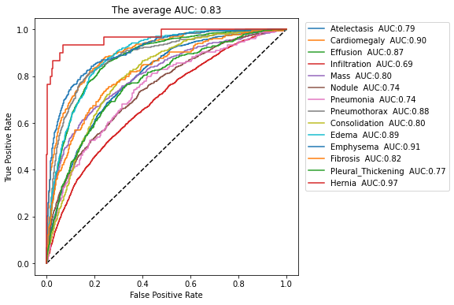
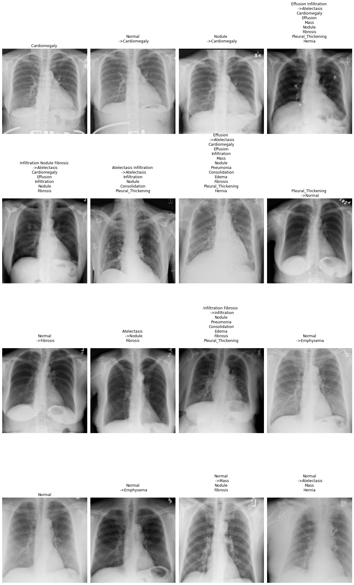

[<- go back to the previous page](../chestxray/README.md)

# Walk Through Part 3. Prediction and Evaluation

# 1. Load the model


```python
model = tf.keras.models.load_model('../input/chestxray-best/nih_densenet121_model.h5', compile=False)
```

# 2. Prediction


```python
y_pred = model.predict(testloader)
```

# 3. Evaluation

## 3.1 Relevant metrics


```python
metrics = ['TP', 'TN', 'FP', 'FN', 'Prevalence', 'Accuracy', 'Precision', 'Recall', 'f1-score','PR AUC', 'ROC AUC']
results = pd.DataFrame(data=[], index = class_names, columns = metrics)
```


```python
def get_metrics_results(label, y_pred, class_names, df):
    label = label.to_numpy()
    for i, class_name in enumerate(class_names):
        df['TP'][class_name] = tf.keras.metrics.TruePositives()(label[:, i], y_pred[:, i]).numpy().astype('int32')
        df['TN'][class_name] = tf.keras.metrics.TrueNegatives()(label[:, i], y_pred[:, i]).numpy().astype('int32')
        df['FP'][class_name] = tf.keras.metrics.FalsePositives()(label[:, i], y_pred[:, i]).numpy().astype('int32')
        df['FN'][class_name] = tf.keras.metrics.FalseNegatives()(label[:, i], y_pred[:, i]).numpy().astype('int32')
        df['Accuracy'][class_name] = tf.keras.metrics.BinaryAccuracy()(label[:, i], y_pred[:, i]).numpy()
        df['Precision'][class_name] = tf.keras.metrics.Precision()(label[:, i], y_pred[:, i]).numpy()
        df['Recall'][class_name] = tf.keras.metrics.Recall()(label[:, i], y_pred[:, i]).numpy()
        df['f1-score'][class_name] = 2 * df['Precision'][class_name] * df['Recall'][class_name]/( df['Precision'][class_name] + df['Recall'][class_name] + 1e-7)
        df['PR AUC'][class_name] = tf.keras.metrics.AUC(curve='PR')(label[:, i], y_pred[:, i]).numpy()
        df['ROC AUC'][class_name] = tf.keras.metrics.AUC(curve='ROC')(label[:, i], y_pred[:, i]).numpy()
        
        df['Prevalence'][class_name] = label[:, i].sum(axis=0)/label.shape[0]
        
    return df
```


```python
results = get_metrics_results(label_test, y_pred, class_names, results)
results.to_csv(output_dir + 'results')
```


```python
results
```


<div>
<style scoped>
    .dataframe tbody tr th:only-of-type {
        vertical-align: middle;
    }

    .dataframe tbody tr th {
        vertical-align: top;
    }

    .dataframe thead th {
        text-align: right;
    }
</style>
<table border="1" class="dataframe">
  <thead>
    <tr style="text-align: right;">
      <th></th>
      <th>TP</th>
      <th>TN</th>
      <th>FP</th>
      <th>FN</th>
      <th>Prevalence</th>
      <th>Accuracy</th>
      <th>Precision</th>
      <th>Recall</th>
      <th>f1-score</th>
      <th>PR AUC</th>
      <th>ROC AUC</th>
    </tr>
  </thead>
  <tbody>
    <tr>
      <th>Atelectasis</th>
      <td>797</td>
      <td>7652</td>
      <td>2730</td>
      <td>350</td>
      <td>0.099488</td>
      <td>0.732848</td>
      <td>0.225971</td>
      <td>0.694856</td>
      <td>0.341035</td>
      <td>0.30357</td>
      <td>0.791514</td>
    </tr>
    <tr>
      <th>Cardiomegaly</th>
      <td>279</td>
      <td>9396</td>
      <td>1775</td>
      <td>79</td>
      <td>0.031052</td>
      <td>0.839188</td>
      <td>0.135833</td>
      <td>0.77933</td>
      <td>0.231343</td>
      <td>0.335431</td>
      <td>0.900263</td>
    </tr>
    <tr>
      <th>Effusion</th>
      <td>1105</td>
      <td>8012</td>
      <td>2154</td>
      <td>258</td>
      <td>0.118224</td>
      <td>0.790788</td>
      <td>0.339061</td>
      <td>0.810712</td>
      <td>0.478148</td>
      <td>0.479529</td>
      <td>0.873256</td>
    </tr>
    <tr>
      <th>Infiltration</th>
      <td>1431</td>
      <td>5152</td>
      <td>4358</td>
      <td>588</td>
      <td>0.175124</td>
      <td>0.570995</td>
      <td>0.247193</td>
      <td>0.708767</td>
      <td>0.366547</td>
      <td>0.320589</td>
      <td>0.68805</td>
    </tr>
    <tr>
      <th>Mass</th>
      <td>368</td>
      <td>8888</td>
      <td>2077</td>
      <td>196</td>
      <td>0.04892</td>
      <td>0.802845</td>
      <td>0.150511</td>
      <td>0.652482</td>
      <td>0.2446</td>
      <td>0.261568</td>
      <td>0.803305</td>
    </tr>
    <tr>
      <th>Nodule</th>
      <td>389</td>
      <td>7553</td>
      <td>3377</td>
      <td>210</td>
      <td>0.051956</td>
      <td>0.688872</td>
      <td>0.103293</td>
      <td>0.649416</td>
      <td>0.178236</td>
      <td>0.180265</td>
      <td>0.743427</td>
    </tr>
    <tr>
      <th>Pneumonia</th>
      <td>81</td>
      <td>9167</td>
      <td>2208</td>
      <td>73</td>
      <td>0.013358</td>
      <td>0.802151</td>
      <td>0.035387</td>
      <td>0.525974</td>
      <td>0.066312</td>
      <td>0.040735</td>
      <td>0.741872</td>
    </tr>
    <tr>
      <th>Pneumothorax</th>
      <td>402</td>
      <td>9202</td>
      <td>1821</td>
      <td>104</td>
      <td>0.043889</td>
      <td>0.83303</td>
      <td>0.180837</td>
      <td>0.794466</td>
      <td>0.294613</td>
      <td>0.305633</td>
      <td>0.881849</td>
    </tr>
    <tr>
      <th>Consolidation</th>
      <td>298</td>
      <td>8708</td>
      <td>2362</td>
      <td>161</td>
      <td>0.039813</td>
      <td>0.781161</td>
      <td>0.11203</td>
      <td>0.649237</td>
      <td>0.191087</td>
      <td>0.132937</td>
      <td>0.801257</td>
    </tr>
    <tr>
      <th>Edema</th>
      <td>204</td>
      <td>9463</td>
      <td>1788</td>
      <td>74</td>
      <td>0.024113</td>
      <td>0.838494</td>
      <td>0.10241</td>
      <td>0.733813</td>
      <td>0.179736</td>
      <td>0.175708</td>
      <td>0.886428</td>
    </tr>
    <tr>
      <th>Emphysema</th>
      <td>200</td>
      <td>10239</td>
      <td>1016</td>
      <td>74</td>
      <td>0.023766</td>
      <td>0.905456</td>
      <td>0.164474</td>
      <td>0.729927</td>
      <td>0.268456</td>
      <td>0.31924</td>
      <td>0.905833</td>
    </tr>
    <tr>
      <th>Fibrosis</th>
      <td>121</td>
      <td>9400</td>
      <td>1941</td>
      <td>67</td>
      <td>0.016307</td>
      <td>0.825831</td>
      <td>0.058681</td>
      <td>0.643617</td>
      <td>0.107556</td>
      <td>0.111078</td>
      <td>0.815286</td>
    </tr>
    <tr>
      <th>Pleural_Thickening</th>
      <td>200</td>
      <td>8911</td>
      <td>2290</td>
      <td>128</td>
      <td>0.02845</td>
      <td>0.790268</td>
      <td>0.080321</td>
      <td>0.609756</td>
      <td>0.141945</td>
      <td>0.107171</td>
      <td>0.772643</td>
    </tr>
    <tr>
      <th>Hernia</th>
      <td>25</td>
      <td>11236</td>
      <td>263</td>
      <td>5</td>
      <td>0.002602</td>
      <td>0.976754</td>
      <td>0.086806</td>
      <td>0.833333</td>
      <td>0.157233</td>
      <td>0.359712</td>
      <td>0.970161</td>
    </tr>
  </tbody>
</table>
</div>


## 3.2 Plot ROC curve and ROC AUC


```python
from sklearn.metrics import roc_auc_score, roc_curve, auc

def compute_AUCs(y_true, y_pred):
    
    AUROCs = []
    y_true_np = y_true.to_numpy()
    y_pred_np = y_pred
    for i in range(n_classes):
        AUROCs.append(roc_auc_score(y_true_np[:, i], y_pred_np[:, i]))
    
    AUROC_avg = np.array(AUROCs).mean()
    
    fig = plt.figure(figsize = (6, 6))
    plt.plot([0, 1], [0, 1], 'k--')
    for idx, class_name in enumerate(class_names):
        fpr, tpr, thresholds = roc_curve(y_true_np[:,idx], y_pred_np[:, idx])
        plt.plot(fpr, tpr, label = '{}  AUC:{:.2f}'.format(class_names[idx], auc(fpr, tpr)))
    plt.legend(loc='upper center', bbox_to_anchor=(1.3, 1), fancybox=True, ncol=1)
    plt.xlabel('False Positive Rate')
    plt.ylabel('True Positive Rate')
    plt.title(f'The average AUC: {AUROC_avg:.2f}');
    
    fig.savefig('trained_net.png')

    return AUROCs
```


```python
AUROCs = compute_AUCs(label_test, y_pred)
```


    

    


## 3.3 Visualize test set images


```python
def testset_visualize(dataloader, y_pred, labeled=True, normalized=True):  

    data = list(dataloader.take(1).as_numpy_iterator())[0]
    images = data[0]
    if labeled:
        labels = data[1]
    
    labels = labels.astype(int)
    pred_labels = (y_pred > 0.5).astype(int)

    fig, axes = plt.subplots(4, 4, figsize=(16, 27))
    axes = axes.flatten()
    for i in range(16):
        if normalized:
            images[i] = denormalize(images[i])
        axes[i].imshow(images[i], cmap='gray')
        axes[i].axis('off')
        if labeled:
            true_label_str = label_to_str(labels[i])
            pred_label_str = label_to_str(pred_labels[i], '\n')
            if str(labels[i]) == str(pred_labels[i]):
                axes[i].set_title(true_label_str)
            else:               
                axes[i].set_title(true_label_str + '\n ->' + pred_label_str)
    plt.tight_layout()
    plt.show()
```


```python
testset_visualize(testloader, y_pred, labeled=True, normalized=True)
```


    

    
[<- go back to the previous page](../chestxray/README.md)
