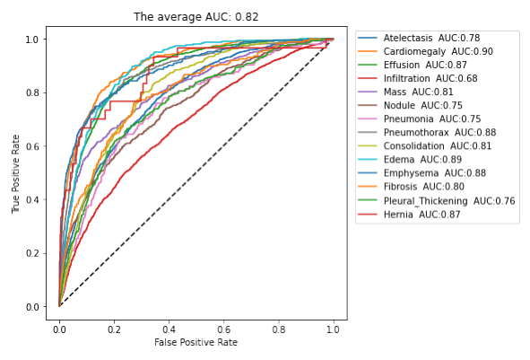
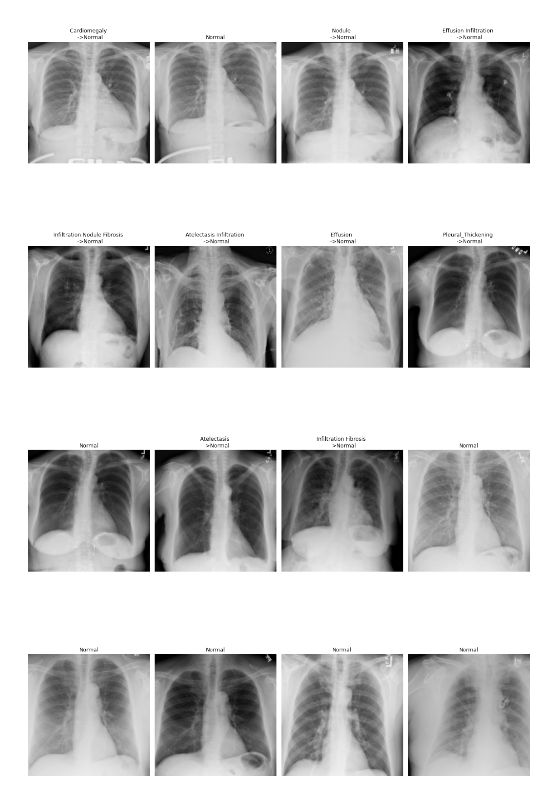

# Results

# 1. Comparision with unweighted loss (BCE)

## 11 metrics results 
### BCE 


```python

```


<div>
<style scoped>
    .dataframe tbody tr th:only-of-type {
        vertical-align: middle;
    }

    .dataframe tbody tr th {
        vertical-align: top;
    }

    .dataframe thead th {
        text-align: right;
    }
</style>
<table border="1" class="dataframe">
  <thead>
    <tr style="text-align: right;">
      <th></th>
      <th>TP</th>
      <th>TN</th>
      <th>FP</th>
      <th>FN</th>
      <th>Prevalence</th>
      <th>Accuracy</th>
      <th>Precision</th>
      <th>Recall</th>
      <th>f1-score</th>
      <th>PR AUC</th>
      <th>ROC AUC</th>
    </tr>
  </thead>
  <tbody>
    <tr>
      <th>Atelectasis</th>
      <td>98</td>
      <td>10291</td>
      <td>91</td>
      <td>1049</td>
      <td>0.099488</td>
      <td>0.901119</td>
      <td>0.518518</td>
      <td>0.085440</td>
      <td>0.146707</td>
      <td>0.310773</td>
      <td>0.783875</td>
    </tr>
    <tr>
      <th>Cardiomegaly</th>
      <td>47</td>
      <td>11138</td>
      <td>33</td>
      <td>311</td>
      <td>0.031052</td>
      <td>0.970162</td>
      <td>0.587500</td>
      <td>0.131285</td>
      <td>0.214612</td>
      <td>0.319030</td>
      <td>0.893210</td>
    </tr>
    <tr>
      <th>Effusion</th>
      <td>389</td>
      <td>9890</td>
      <td>276</td>
      <td>974</td>
      <td>0.118224</td>
      <td>0.891578</td>
      <td>0.584962</td>
      <td>0.285400</td>
      <td>0.383629</td>
      <td>0.477162</td>
      <td>0.871852</td>
    </tr>
    <tr>
      <th>Infiltration</th>
      <td>81</td>
      <td>9403</td>
      <td>107</td>
      <td>1938</td>
      <td>0.175124</td>
      <td>0.822621</td>
      <td>0.430851</td>
      <td>0.040119</td>
      <td>0.073403</td>
      <td>0.317599</td>
      <td>0.677662</td>
    </tr>
    <tr>
      <th>Mass</th>
      <td>50</td>
      <td>10911</td>
      <td>54</td>
      <td>514</td>
      <td>0.048920</td>
      <td>0.950733</td>
      <td>0.480769</td>
      <td>0.088652</td>
      <td>0.149701</td>
      <td>0.261641</td>
      <td>0.807418</td>
    </tr>
    <tr>
      <th>Nodule</th>
      <td>47</td>
      <td>10857</td>
      <td>73</td>
      <td>552</td>
      <td>0.051956</td>
      <td>0.945789</td>
      <td>0.391667</td>
      <td>0.078464</td>
      <td>0.130737</td>
      <td>0.191483</td>
      <td>0.748301</td>
    </tr>
    <tr>
      <th>Pneumonia</th>
      <td>0</td>
      <td>11375</td>
      <td>0</td>
      <td>154</td>
      <td>0.013358</td>
      <td>0.986642</td>
      <td>0.000000</td>
      <td>0.000000</td>
      <td>0.000000</td>
      <td>0.040491</td>
      <td>0.738170</td>
    </tr>
    <tr>
      <th>Pneumothorax</th>
      <td>86</td>
      <td>10937</td>
      <td>86</td>
      <td>420</td>
      <td>0.043889</td>
      <td>0.956111</td>
      <td>0.500000</td>
      <td>0.169960</td>
      <td>0.253687</td>
      <td>0.322452</td>
      <td>0.870508</td>
    </tr>
    <tr>
      <th>Consolidation</th>
      <td>0</td>
      <td>11070</td>
      <td>0</td>
      <td>459</td>
      <td>0.039813</td>
      <td>0.960187</td>
      <td>0.000000</td>
      <td>0.000000</td>
      <td>0.000000</td>
      <td>0.127987</td>
      <td>0.805243</td>
    </tr>
    <tr>
      <th>Edema</th>
      <td>4</td>
      <td>11240</td>
      <td>11</td>
      <td>274</td>
      <td>0.024113</td>
      <td>0.975280</td>
      <td>0.266667</td>
      <td>0.014388</td>
      <td>0.027304</td>
      <td>0.158447</td>
      <td>0.886959</td>
    </tr>
    <tr>
      <th>Emphysema</th>
      <td>56</td>
      <td>11198</td>
      <td>57</td>
      <td>218</td>
      <td>0.023766</td>
      <td>0.976147</td>
      <td>0.495575</td>
      <td>0.204380</td>
      <td>0.289406</td>
      <td>0.300044</td>
      <td>0.866068</td>
    </tr>
    <tr>
      <th>Fibrosis</th>
      <td>0</td>
      <td>11341</td>
      <td>0</td>
      <td>188</td>
      <td>0.016307</td>
      <td>0.983693</td>
      <td>0.000000</td>
      <td>0.000000</td>
      <td>0.000000</td>
      <td>0.086079</td>
      <td>0.772426</td>
    </tr>
    <tr>
      <th>Pleural_Thickening</th>
      <td>0</td>
      <td>11199</td>
      <td>2</td>
      <td>328</td>
      <td>0.028450</td>
      <td>0.971377</td>
      <td>0.000000</td>
      <td>0.000000</td>
      <td>0.000000</td>
      <td>0.097168</td>
      <td>0.751570</td>
    </tr>
    <tr>
      <th>Hernia</th>
      <td>0</td>
      <td>11499</td>
      <td>0</td>
      <td>30</td>
      <td>0.002602</td>
      <td>0.997398</td>
      <td>0.000000</td>
      <td>0.000000</td>
      <td>0.000000</td>
      <td>0.136066</td>
      <td>0.701610</td>
    </tr>
  </tbody>
</table>
</div>


### Weighted BCE


```python

```


<div>
<style scoped>
    .dataframe tbody tr th:only-of-type {
        vertical-align: middle;
    }

    .dataframe tbody tr th {
        vertical-align: top;
    }

    .dataframe thead th {
        text-align: right;
    }
</style>
<table border="1" class="dataframe">
  <thead>
    <tr style="text-align: right;">
      <th></th>
      <th>TP</th>
      <th>TN</th>
      <th>FP</th>
      <th>FN</th>
      <th>Prevalence</th>
      <th>Accuracy</th>
      <th>Precision</th>
      <th>Recall</th>
      <th>f1-score</th>
      <th>PR AUC</th>
      <th>ROC AUC</th>
    </tr>
  </thead>
  <tbody>
    <tr>
      <th>Atelectasis</th>
      <td>797</td>
      <td>7652</td>
      <td>2730</td>
      <td>350</td>
      <td>0.099488</td>
      <td>0.732848</td>
      <td>0.225971</td>
      <td>0.694856</td>
      <td>0.341035</td>
      <td>0.30357</td>
      <td>0.791514</td>
    </tr>
    <tr>
      <th>Cardiomegaly</th>
      <td>279</td>
      <td>9396</td>
      <td>1775</td>
      <td>79</td>
      <td>0.031052</td>
      <td>0.839188</td>
      <td>0.135833</td>
      <td>0.77933</td>
      <td>0.231343</td>
      <td>0.335431</td>
      <td>0.900263</td>
    </tr>
    <tr>
      <th>Effusion</th>
      <td>1105</td>
      <td>8012</td>
      <td>2154</td>
      <td>258</td>
      <td>0.118224</td>
      <td>0.790788</td>
      <td>0.339061</td>
      <td>0.810712</td>
      <td>0.478148</td>
      <td>0.479529</td>
      <td>0.873256</td>
    </tr>
    <tr>
      <th>Infiltration</th>
      <td>1431</td>
      <td>5152</td>
      <td>4358</td>
      <td>588</td>
      <td>0.175124</td>
      <td>0.570995</td>
      <td>0.247193</td>
      <td>0.708767</td>
      <td>0.366547</td>
      <td>0.320589</td>
      <td>0.68805</td>
    </tr>
    <tr>
      <th>Mass</th>
      <td>368</td>
      <td>8888</td>
      <td>2077</td>
      <td>196</td>
      <td>0.04892</td>
      <td>0.802845</td>
      <td>0.150511</td>
      <td>0.652482</td>
      <td>0.2446</td>
      <td>0.261568</td>
      <td>0.803305</td>
    </tr>
    <tr>
      <th>Nodule</th>
      <td>389</td>
      <td>7553</td>
      <td>3377</td>
      <td>210</td>
      <td>0.051956</td>
      <td>0.688872</td>
      <td>0.103293</td>
      <td>0.649416</td>
      <td>0.178236</td>
      <td>0.180265</td>
      <td>0.743427</td>
    </tr>
    <tr>
      <th>Pneumonia</th>
      <td>81</td>
      <td>9167</td>
      <td>2208</td>
      <td>73</td>
      <td>0.013358</td>
      <td>0.802151</td>
      <td>0.035387</td>
      <td>0.525974</td>
      <td>0.066312</td>
      <td>0.040735</td>
      <td>0.741872</td>
    </tr>
    <tr>
      <th>Pneumothorax</th>
      <td>402</td>
      <td>9202</td>
      <td>1821</td>
      <td>104</td>
      <td>0.043889</td>
      <td>0.83303</td>
      <td>0.180837</td>
      <td>0.794466</td>
      <td>0.294613</td>
      <td>0.305633</td>
      <td>0.881849</td>
    </tr>
    <tr>
      <th>Consolidation</th>
      <td>298</td>
      <td>8708</td>
      <td>2362</td>
      <td>161</td>
      <td>0.039813</td>
      <td>0.781161</td>
      <td>0.11203</td>
      <td>0.649237</td>
      <td>0.191087</td>
      <td>0.132937</td>
      <td>0.801257</td>
    </tr>
    <tr>
      <th>Edema</th>
      <td>204</td>
      <td>9463</td>
      <td>1788</td>
      <td>74</td>
      <td>0.024113</td>
      <td>0.838494</td>
      <td>0.10241</td>
      <td>0.733813</td>
      <td>0.179736</td>
      <td>0.175708</td>
      <td>0.886428</td>
    </tr>
    <tr>
      <th>Emphysema</th>
      <td>200</td>
      <td>10239</td>
      <td>1016</td>
      <td>74</td>
      <td>0.023766</td>
      <td>0.905456</td>
      <td>0.164474</td>
      <td>0.729927</td>
      <td>0.268456</td>
      <td>0.31924</td>
      <td>0.905833</td>
    </tr>
    <tr>
      <th>Fibrosis</th>
      <td>121</td>
      <td>9400</td>
      <td>1941</td>
      <td>67</td>
      <td>0.016307</td>
      <td>0.825831</td>
      <td>0.058681</td>
      <td>0.643617</td>
      <td>0.107556</td>
      <td>0.111078</td>
      <td>0.815286</td>
    </tr>
    <tr>
      <th>Pleural_Thickening</th>
      <td>200</td>
      <td>8911</td>
      <td>2290</td>
      <td>128</td>
      <td>0.02845</td>
      <td>0.790268</td>
      <td>0.080321</td>
      <td>0.609756</td>
      <td>0.141945</td>
      <td>0.107171</td>
      <td>0.772643</td>
    </tr>
    <tr>
      <th>Hernia</th>
      <td>25</td>
      <td>11236</td>
      <td>263</td>
      <td>5</td>
      <td>0.002602</td>
      <td>0.976754</td>
      <td>0.086806</td>
      <td>0.833333</td>
      <td>0.157233</td>
      <td>0.359712</td>
      <td>0.970161</td>
    </tr>
  </tbody>
</table>
</div>


## ROC curve and AUC 
### BCE


```python

```


    

    


### Weighted BCE


```python

```


    

    


## Visualize test set images
### BCE


```python

```


    

    


## Weighted BCE


```python

```


    

    


# 2. Comparison with previous works


```python

```


<div>
<style scoped>
    .dataframe tbody tr th:only-of-type {
        vertical-align: middle;
    }

    .dataframe tbody tr th {
        vertical-align: top;
    }

    .dataframe thead th {
        text-align: right;
    }
</style>
<table border="1" class="dataframe">
  <thead>
    <tr style="text-align: right;">
      <th></th>
      <th>Wang et al. (2017)</th>
      <th>Yao et al. (2017)</th>
      <th>Rajpurkar et al.(CheXNet) (2017)</th>
      <th>Our model</th>
    </tr>
  </thead>
  <tbody>
    <tr>
      <th>Atelectasis</th>
      <td>0.716</td>
      <td>0.772</td>
      <td>0.8094</td>
      <td>0.7915</td>
    </tr>
    <tr>
      <th>Cardiomegaly</th>
      <td>0.807</td>
      <td>0.904</td>
      <td>0.9248</td>
      <td>0.9003</td>
    </tr>
    <tr>
      <th>Effusion</th>
      <td>0.784</td>
      <td>0.859</td>
      <td>0.8638</td>
      <td>0.8733</td>
    </tr>
    <tr>
      <th>Infiltration</th>
      <td>0.609</td>
      <td>0.695</td>
      <td>0.7345</td>
      <td>0.6881</td>
    </tr>
    <tr>
      <th>Mass</th>
      <td>0.706</td>
      <td>0.792</td>
      <td>0.8676</td>
      <td>0.8033</td>
    </tr>
    <tr>
      <th>Nodule</th>
      <td>0.671</td>
      <td>0.717</td>
      <td>0.7802</td>
      <td>0.7434</td>
    </tr>
    <tr>
      <th>Pneumonia</th>
      <td>0.633</td>
      <td>0.713</td>
      <td>0.7680</td>
      <td>0.7419</td>
    </tr>
    <tr>
      <th>Pneumothorax</th>
      <td>0.806</td>
      <td>0.841</td>
      <td>0.8887</td>
      <td>0.8818</td>
    </tr>
    <tr>
      <th>Consolidation</th>
      <td>0.708</td>
      <td>0.788</td>
      <td>0.7901</td>
      <td>0.8013</td>
    </tr>
    <tr>
      <th>Edema</th>
      <td>0.835</td>
      <td>0.882</td>
      <td>0.8878</td>
      <td>0.8864</td>
    </tr>
    <tr>
      <th>Emphysema</th>
      <td>0.815</td>
      <td>0.829</td>
      <td>0.9371</td>
      <td>0.9058</td>
    </tr>
    <tr>
      <th>Fibrosis</th>
      <td>0.769</td>
      <td>0.767</td>
      <td>0.8047</td>
      <td>0.8153</td>
    </tr>
    <tr>
      <th>Pleural Thickening</th>
      <td>0.708</td>
      <td>0.765</td>
      <td>0.8062</td>
      <td>0.7726</td>
    </tr>
    <tr>
      <th>Hernia</th>
      <td>0.767</td>
      <td>0.914</td>
      <td>0.9164</td>
      <td>0.9702</td>
    </tr>
  </tbody>
</table>
</div>


```python

```
